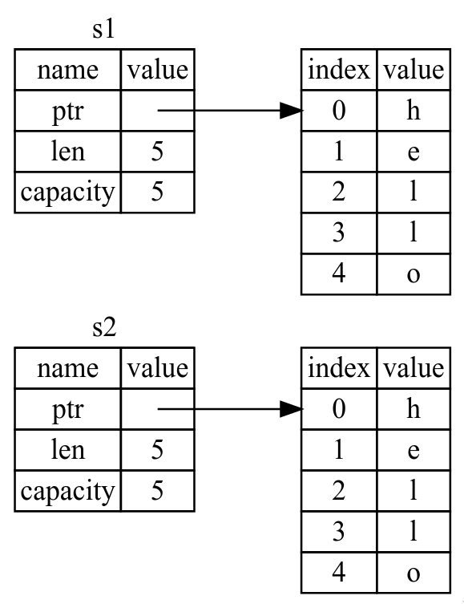
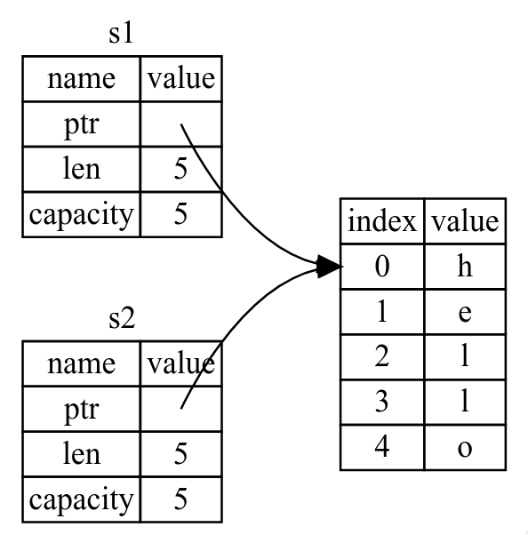
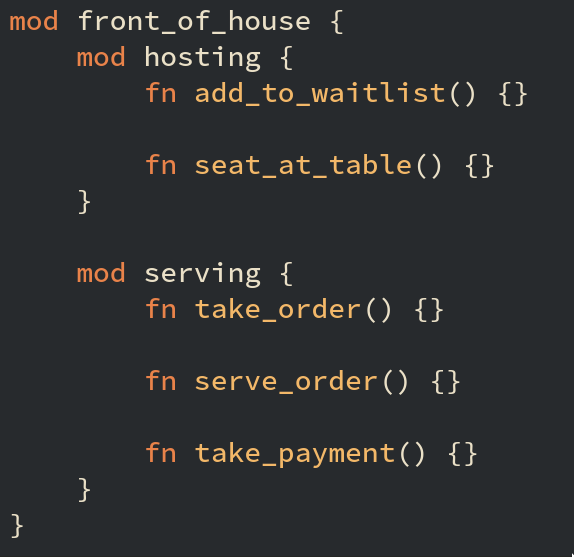
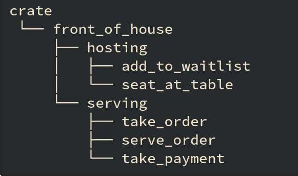
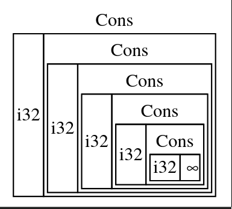
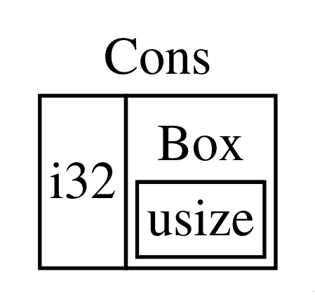

\newpage

# Basic Concepts

## Variable Bindings

Use `let` to introduce a **variable binding**. These are immutable by default. Use `mut` to make them mutable:

```rust
let mut x = 0;
```

Rust is **statically typed**: specify your types up front. 

```rust
let x: i32 = 5;
```

Bindings cannot be accessed outside of the scope they are defined in. 

Bindings can be **shadowed** (overwritten):

```rust
let mut y: i32 = 1;
y = 2; // mutate y
let y = y; // y now immutable and bound to 2
let y = "text"; // rebind y to different type
```

## Functions

Define a function with `fn`:

```rust
fn foo() {
	// do stuff here
}
```

Every program has a `main` function. 

Functions can take arguments. The type of the argument must be declared. 

Functions can return arguments. Use `->` to indicate the return, and declare the type after the arrow. The last line in the function is what is returned. Do not insert a semicolon at the end of that line. 
```rust
fn add(x: i32, y: i32) -> i32 {
	foo();
	x + y
}
```

## Expressions and Statements 

**Expressions** return a value, and **statements**, indicated by a semicolon, do not. Semicolons are used to turn expressions into statements (ie. suppress output). 

Assignments to already-bound variables are expressions, but the value returned is `()` rather than the "expected" value. This is because the assigned value can only have one owner:
```rust
let mut y = 5;
let x = (y = 6); // x has value '()' rather than 6
```

Variable bindings can point to functions:
```rust
fn add(x: i32, y: i32) -> i32 {
	x + y
}
let f: fn(i32) -> i32 = add; // or, let f = add;
let six = f(1, 5);
```

## Primitive Types

### Boolean 
`bool`: `true` or `false`

### char
A single Unicode value. Created with `''`.
```rust
let x = 'x';
let x = '1';
```

### Numerics 

- **Signed vs unsigned**: Signed integers support both positive and negative values, whereare unsigned integers can only store positive values. For a fixed size, an unsigned integer can store larger positive values. Signed integers are denoted by `i` (eg. `i8` for a signed eight-bit number), and unsigned by `u` (eg. `u16`).

- **Fixed vs variable size**: Fixed size types have a specific number of bits they can store. Sizes can be `8`, `16`, `32` or `64` (eg. `i32`, `u16`). Variable size types are denoted by `isize` and `usize`. 

- **Floating-point**: Denoted by `f32` (single precision) and `f64` (double precision).

### Arrays

An array is a fixed-size list of elements of the same type. They are immutable by default. 

```rust 
let a = [1, 2, 3];
let b = [0; 20]; // 20 elements, each with a value of 0 
let a_length = a.len(); 
let a_first = a[0]
```

### Tuples
Tuples are ordered lists of fixed sizes. They can contain multiple types. Fields of tuples can be **destructured** using `let`:
```rust
let x: (i32, &str) = (1, "hello");
let (a, b) = x; // a gets 1, b gets "hello" 
let (c, d) = ("test", 5);
```

Elements of a tuple can be accessed using dot notation:
```rust
let tup = (1, 2, 3, 4); 
let x = tup.0;
let y = tup.3;
```

## if 

Use an `if` expression (not statement!) to conditionally run code:
```rust
let x = 5;

if x == 5 {
	println!("x is five")
} else if x == 6 {
	println!("x is six")
} else {
	println!("asdf")
}
```

Since `if` is an expression, it can return a value:
```rust
let x = 5;
let y = if 5 { 10 } else { 15 };  // y is 10
```

If there is no `else`, then the return value is `()`.

## Loops

Use for loops to loop over an iterable:
```rust
for i in 0..10 {
	println!("{}", x);
}
```
where `0..10` gives an iterable range that is inclusive of the first number and exclusive of the second number. You can also use `0..=10` to produce a range that is inclusive on both ends.

Use `.enumerate()` to keep track of how many times you have looped:
```rust
for (i, j) in (2..5).enumerate() {
	println!("{} {}", i, j)
}

// Output: 
// 0 2
// 1 3
// 2 4
```

Use `while` for while loops. Keep looping while some condition holds. 
```rust
let mut x = 5;
let mut done = false;

while !done {
	x += 1;
	if x % 10 == 0 {
		done = true;
	}
}
```

Use `loop` for infinite loops (instead of writing `while true`)
```rust
loop {
	println!("loop forever")
}
```

Use `break` to break out of the loop (can combine with `loop` instead of explicitly defining a `done` condition). 

Use `continue` to skip to the next iteration.

# Ownership

Rust follows three ownership rules:

1. Each value has a variable called an **owner**.
2. There can only be one owner at a time. 
3. When the owner goes out of scope, the value is dropped. 

## Stack vs heap

The stack stores values in a stack-like structure: last in, first out. Adding data to the stack is called pushing to the stack, and removing data is called popping off the stack. Data stored on the stack must have a known, fixed size. 

When storing data on the heap, a certain amount of memory is requested. The heap finds a place large enough, marks it as being used, and then returns a **pointer**, which gives the address of that place. This is called **allocation**. To get the data, you follow the pointer to get to the address. 

Pushing to the stack is faster than allocating on the heap because there is no need to search for free space: the location is always the top of the stack. Similarly, accessing data is also faster, because you don't need to follow a pointer. 

Function parameters and variables inside functions are pushed to the stack, and then popped off the stack once the function has completed. 

## Variable scope

The **scope** is the range in which an item is valid. A scope can be created with `{}`.
```rust
{ // create a new scope 
	let s = "hello"; // s is valid here.
	// do stuff with s.
} // scope is over. s no longer valid.
```

A variable is valid when it comes into scope, and remains valid until it goes out of scope. 

## `String` type

The `String` type is stored on the heap (and thus is able to store an arbitrary amount of text). They are also mutable, whereas string literals are not. Strings are created from string literals as follows:
```rust
let mut s = String::from("hello");
s.push_str(", world");
// s has "hello, world"
```

## Memory management

The reason why `String` types are mutable and literals are not has to do with memory. `String` types request memory from the OS during runtime (done with `String::from`), and return the memory when the `String` is finished being used. 

Memory return is usually done with a **garbage collector (GC)**, which keeps track of memory that is no longer being used, and cleans it up automatically, or by allocating and freeing memory manually.

Rust takes a different approach and automatically (and deterministically) frees up memory once the variable goes out of scope by calling a special `drop` function (eg. at `}`).

## Move, copy, and clone

There are two ways to bind a variable to another.

{width=40%}
\hfill
{width=40%}
\begin{figure}[!h]
\begin{subfigure}[t]{0.4\textwidth}
\caption{Deep copy. The actual data is copied.}
\end{subfigure}
\hfill
\begin{subfigure}[t]{0.4\textwidth}
\caption{Shallow copy. The metadata and pointer are copied, but the actual data itself is not.}
\end{subfigure}
\end{figure}

For data types with a trait called `Copy`, which are usually known-size data that lives only on the stack (eg. ints, bool, floats, char, tuples containing only the previous types), such a binding copies the actual data into the second variable. 

```rust
let s1 = "hello"; // s1 gets "hello"
let s2 = s1; // s2 gets "hello",and s1 remains unchanged. 
```

This is fine because this data lives entirely on the stack, so copies of the actual values are quick to make. Here, shallow copy and deep copy are the same thing. 


Data types without a known size at compile time live on the heap. For this data, deep copying may not be a great idea. The first variable can point to a large amount of data, and copying everything may be very expensive. Instead, we can do a shallow copy. The problem with this is that when `s1` and `s2` both go out of scope, they will both try to free the same memory. This is called a **double free error** and is not safe. To fix this, Rust **transfers ownership** of the data to `s2`, and invalidates `s1` immediately. Then, when `s2` goes out of scope, it and it alone will free the memory. 

\begin{figure*}[!h]
\centering
\includegraphics[width=0.5\linewidth]{images/move.png}
\caption{Representation in memory after `s1` is invalidated.}
\end{figure*}

```rust 
let s1 = String::from("hello");
let s2 = s1; // s2 gets `String` type "hello", and s1 is invalidated. 
```

If we really want to do a deep copy of the heap data, then we can invoke the `clone` method:
```rust
let s1 = String::from("hello");
let s2 = s1.clone(); // s1 remains valid.
```

## Functions

Passing a value into a function also transfers ownership of the data to the function as if it were a binding. The variable (unless it is `Copy` is invalid outside of that function. When that function completes, the variable goes out of scope. Function returns also transfer ownership in the same way. 

```rust
fn main() {
	let s = String::from("hello"); // s comes into scope.
	f_take(s); // s moves into the scope of f_take
			   // and is no longer valid in main.

	let x = 5;
	f_copy(x); // x moves into the scope of f_copy	
			   // but x is i32, which is Copy.
			   // so x remains valid here.
	// do stuff with x.

	let s2 = String::from("hello"); // s2 comes into scope.
	let s3 = f_take_give_back(s2) // s2 moves into the scope of f_take_give_back
								  // s2 is no longer valid in main. 
								  // f_take_give_back returns its value into s3. 
} // s3 goes out of scope here. s2 is already invalid...
  // ...x goes out of scope. s is already invalid.

fn f_take(some_str: String) { // some_str comes into scope.
	// do stuff with some_str.
} //some_str goes out of scope. 

fn f_copy(some_int: i32) { // some_int comes into scope.
	// do stuff with some_int
} // some_int goes out of scope...
  // ...nothing special happens because it is a copied valued. 

fn f_take_give_back(some_str: String) -> String { // some_str comes into scope
	some_str // some_str is returned and ownership is transferred out of the function	
}
```

# References and Borrowing

In order to get the value of a variable without taking ownership, use `&`. This passes a **reference** of the object instead of the object itself. This is called **borrowing**. 

```rust
fn main() {
	let s1 = String::from("hello");
	let len1 = calculate_len1(&s1); // pass a reference of s1.
	// s1 is still valid here. 
	let len2 = calculate_len2(s1); // pass s1 itself.
	// ownership of s1 has been transferred to calculate_len2
	// s1 is no longer valid here. 
}

fn calculate_len1(s: &String) -> usize {
	s.len()
} // function does not have ownership of s. 
  // s goes out of scope but nothing special happens. 

fn calculate_len2(s: String) -> usize { // s comes into scope.
	s.len()
} // function has ownership of s, and it goes out of scope here. 
  // drop gets called, and the memory of s is cleared. 
```

## Mutable references

References are by default immutable. This is to prevent **data races**, which happen when:
- two or more pointers access the same data at the same time,
- at least one of the pointers is being used to write to the data, and
- there is no synchronized access to the data.

Mutable references are allowed under some restrictions using `&mut`:
- There can only be one mutable reference to a particular piece of data within a particular scope. 
	- It is possible to create a new scope with `{}` and use multiple mutable references in different scopes. 
- It is not possible to combine mutable and immutable references in the same scope. 

The scope of a reference starts from where it is introduced, and ends after the last time it is used. The following codde is permitted, because the scopes of the immutable reference `s1` ends before the mutable reference `s2` is introduced:

```rust
let mut s = String::from("hello");

let s1 = &s;
println!("{}", s1);
// s1 no longer being used.

let s2 = &mut s; // this is fine.
```

## Dangling references

A **dangling pointer** is a pointer that references a location in memory that might have been given to someone else (ie. memory was freed while the pointer was preserved). Rust will automatically prevent this from compiling. 

```rust
fn main() {
	let dead_reference = dangle();
}

fn dangle() -> &String {
	let s = String::from("hello"); // s comes into scope.

	&s // return reference to s
} // s goes out of scope. but the reference (to this invalid String) has been stored.
```

## Slice

Slicing allows a "view" into a collection of elements without ownership. Use `&` to indicate that slices are like references. We can also make references to a portion of the collection. 

```rust
let a = [0, 1, 2, 3, 4];
let complete = &a[..] // slice with all elements 
let middle = &a[1..4] // slice with 1, 2, 3

let s = String::from("hello");
let first_two = &a[..2] // slice with "he"
let last_two = &a[3..] // slice with "lo"
```

A string slice is denoted `&str`. String literals are actually string slices. This is why they are immutable: they are immutable references. 

When writing a function to take in a string, it is better to use `&str` as the parameter instead of `&String`. Using `&str` means that if we have a `String`, we can pass a slice of the entire string, but if we only have a slice, then we can just pass the slice. It allows for more general use without any loss of functionality. 
```rust 
fn some_fn(s: &str) -> &str { // this is better.
...
fn some_fn(s: &String) -> &str { // dont do this.
```

# Lifetimes

Every reference has a **lifetime**, which is the scope for which that reference is valid. This is done to prevent dangling references. Most of the times lifetimes are determined by Rust's compiler (via **lifetime elision rules**). Sometimes we need to explicitly annotate lifetimes in order to ensure that the underlying value being referenced lives at least as long as the reference itself(? opposite?) (it doesn't get dropped before the reference does, which would leave the reference dangling). Lifetime parameters can be generic (denoted by `<>`), so that functions can accept references with any lifetime. Lifetimes are given by `'`, and conventionally go by alphabetical order (ie. `'a`, `'b`, etc.). Lifetimes are really just to make life easier for the compiler. They don't modify the actual lifetimes. 

The following function signature says that for some lifetime `'a`, the function takes two parameters and returns one parameter, all of which will live at least as long as `'a`. 

```rust
fn longest<'a'>(x: &'a str, y: &'a str) -> &'a str {
```


```rust
struct Excerpt<'a> {
	part: &'a str,
}
```

## Static 

A special lifetime is the `'static` lifetime, which means that the reference can live for the entire duration of the program. All string literals have `'static` lifetime, and can be annotated explicitly using `&'static str`. 

# Structs

## Classic C structs

Structs are labelled and grouped collections of data (called **fields**). After defining a struct, we create an instance of it and specify concrete values for each of the fields. We can use dot notation to get the value of a particular field, or to change it. In order to change a field, the entire struct instance must be marked with `mut`. 

```rust 
struct User {
	username: String,
	n_logins: u32,
	active: bool,
};

let mut user1 = User {
	username: String::from("test"),
	n_logins: 16,
	active: true,
};

user1.active = false;

```

To create a new instance of a struct quickly using most of another instance's values, you can use the **struct update syntax**:

```rust
let user2 = User {
	username: String::from("other"),
	n_logins: 16, // unchanged
	active: false, // unchanged
}
... // equivalent to the following:
let user2 = User {
	username: String::from("other"),
	..user1 // struct update
}

```

## Tuple structs 

Tuple structs are like named tuples, or C structs without field labels:

```rust
struct Point(i32, i32); // define struct.
let origin = Point(0, 0); // create instance. 
let (x, y) = origin; // destructure.
```

## Methods

To give a struct a method that it can call, use `impl`. The first parameter of a method is always `self`, which is the instance of the struct that the method is being called on. Multiple methods can be defined in an `impl` block. 

```rust
struct Rectangle {
	width: u32,
	height: u32,
}

impl Rectangle {
	fn area(&self) -> u32) {
		self.width * self.height
	}

	fn can_hold(&self, other: &Rectangle) -> bool {
		self.width >= other.width && self.height >= other.height
	}
}
```

## Associated Functions

Associated functions are functions (not methods) defined within `impl` which do not take `self` as a parameter. `String::from` is an example of an associated function. These are often used for returning a new instance of the struct. 

```rust
impl Rectangle {
	fn square(size: u32) -> Rectangle {
		Rectangle {
			width: size,
			height: size,
		}
	}
}

let sq5 = Rectangle::square(5);
```

# Enums

Enums are used to define different possible variants of some type of data. A instance can only be one variant. Functions that are set up to take in an `enum` can take any variant. Each variant can have some data associated with it, and the types can differ. `impl` can also be used with `enum`. 

```rust
enum Message {
	Quit,
	Move {x: i32, y: i32},
	Write(String),
	ChangeColor(i32, i32, i32),
}

impl Message {
	fn call(&self) {
		// method here. 
	}
}

let m = Message::ChangeColor(5, 23, 52);
m.call();
```

## Option

`Option` is a special `enum` that encodes the concept of a value being present or absent (like a null value, which Rust doesn't have (for safety purposes)). The `<T>` is a generic type which indicates that it can take any type. 

```rust
enum Option<T> {
    Some(T),
    None,
}
```

Note that a variable of type `Option<T>` and one of type `T` are not the same. They cannot interact like two `T` variables can. 

## match

`match` is used to compare a value against a series of patterns and conditionally execute code based on the match. Unlike `if`, the expression doesn't need to return a boolean. Each condition in the `match` is called an **arm**, which is comprised of a pattern and some code, separated by `=>`. It is possible to get the value inside the variant, and then perform some action on that value. Matches are exhaustive: all cases must be explicitly covered. In many cases, the equivalent of an `else` statement is the pattern `_`, which matches any value. 

```rust
enum issue_year {
    2000, 
    2001,
    2002,
}
enum coin {
    penny,
    nickel,
    dime(issue_year),
    quarter,
    loonie,
    toonie,
}

fn get_small_vals(c: coin) -> u8 {
    match c {
	coin::penny => 1,
	coin::nickel => 5,
	coin::dime(issue_year) => {
	    println!("This dime was issued in {}", issue_year);
	    10
	},
	coin::quarter => {
	    println!("\"quarter\" variant has no data to destructure");
	    25
	},
	_ => {
	    println!("value too large");
	    0
	},
    }
}
```

It is also possible to match multiple patterns or a range:

```rust
let x = 5;

match x {
    1 | 2 => println!("one or two"),
    _ => println!("anything else"),
}

let y = 'e';

match y {
    'a'..'j' => println!("early ASCII letter"),
    'k'..'z' => println!("late ASCII letter"),
    _ => println!("something else"),
}


# Generics 

Generics can be used to write code that applies to many different types without knowing beforehand what the type will be. Generics are usually denoted by `<T>`. There is no performance cost to using generics because Rust applies **monomorphization** and turns the generic code into a concrete type during compilation. 

## Functions

```rust 
fn largest<T>(list: &[T]) -> {
```
means that the function `largest` is generic over some type `T`. It has one parameter named `list`, which is a slice of values of type `T`. It returns a value of the same type `T`. Because this function is defined generically, it could be applied to slice of `ints` or a slice of `chars` in the same way. 

## Structs

```rust
struct Point<T> {
	x: T,
	y: T,
}

let integer = Point{x: 5, y: 10};
let float = Point{x: 1.2, y: 5.0};
```

Note that although generics can work with different types, for a given instantiation, the `T` is fixed. That is, we cannot define `Point` with `x` and `y` as different types, unless we define it as follows:

```rust
struct Point<T, U> {
	x: T,
	y: U,
}

let int_and_float = Point{x: 5, y: 10.5};
let both_floats = Point{x: 1.2, y: 5.0};
```

## Methods

In order to declare that a method takes a generic, we use `impl<T>`:

```rust
struct Point<T> {
	x: T,
	y: T,
}
impl<T> Point<T> {
	fn x(&self) -> &T {
		&self.x
	}
}
```

# Traits

Different types share the same behaviour if we can call the same methods on all those types: traits are used to group a set of behaviours that perform the same task. Think about traits as abstract methods that are then defined more specifically by types that have that trait. It is also possible to define some default behaviour for a trait. 

```rust 
pub trait Summary {
	fn summarize_author(&self) -> String; // trait method.

	fn summarize(&self) -> String { // default behaviour. no need to redefine. 
		println!("Written by {}...", self.summarize_author())
	}
}

impl Summary for Tweet { // give type `Tweet` the trait `Summary`
	fn summarize_author(&self) -> String { // implement summarize_author, which...
		println!("@{}", self.username)     // ... has no default behaviour
	}
}

impl Summary for Article {
	fn summarize_author(&self) -> String { // different implementation
		println!("{} {}", self.first, self.last)
	}
}
```

We can write functions that accept only parameters which have a some trait, and return types that have a trait. However, only one type can be returned (ie. cannot return two different types which both implement the same trait):

```rust 
fn notify(item: impl Summary) -> impl Summary { // accepts any type with trait Summary
												// returns type with trait Summary
```

which is really just syntactic sugar for a **trait bound**:

```rust
fn notify<T: Summary>(item: T) {
```

We can use trait bounds to take two parameters that both implement Summary, but to force them to be the same type:

```rust
fn notify(item1: impl Summary, item2: impl Summary) { // can be any two Types...
													  // ... with impl Summary
...
fn notify<T: Summary>(item1: T, item2: T) { // both have to be the same type...
											// ... which has impl Summary
```

We can specify multiple bounds:

```rust
fn notify(item: impl Summary + Display) { // must have both Summary and Display
```

`where` is used to write cleaner trait bounds:

```rust
fn notify<T, U>(item1: T, item2: U)
	where T: Display + Clone, // input with type T must have both Display and Clone
		  U: Clone + Debug 
	{
		// ...
	}
```

**Blanket implementations** are implementations of a trait on a type that satisfies some trait bound:

```rust 
impl<T: Display> ToString for T { // impl ToString on some type T with trait Display
```

# Managing Projects

## Crates

A **crate** is a binary or library. A **package** is one or more crates that provide a set of functionality, and it contains a **Cargo.toml** file that describes how to build those crates. A package can contain any number of binary crates, and zero or one library crates.

If a package contains `src/main.rs`, it has a binary crate. If it contains `src/lib.rs`, it has a library crate. It can have both. A package with multiple binary crates has its files in `src/bin/`.

To bring in functionality from a crate, we use `crateName::thing`.

## Modules

Modules are used to organize code within a crate into a module tree, and to control whether code is public (usable by outside code) or private. Modules are defined with `mod`. 

{width=40%}
\hfill
{width=40%}
\begin{figure}[!h]
\caption{Code implementation of module organization, and the corresponding module tree representation.}
\end{figure}

Modules are referenced using either absolute or relative paths, with each "level" separated by `::`. Absolute paths start with `crate` at the crate root, and relative paths start with the current module.

### pub

In order for other code to be able to access modules, they must be public: mark modules as public with `pub`. Functions can access other modules that are defined in the same module/crate, even if they are not public. We can also go up module levels using `super`, which is like `..`. 

```rust
mod lev1 { // not public, but accessible by testing because...
		   // ...lev1 and testing are defined in the same module
	pub mod lev2 { // make this public so it is accessible. 
		pub fn add() {}
		
		pub fn subtract() {
			super::something(); // super refers to lev1 here
		}
	}

	pub fn something() {}
}

pub fn testing() {
	// absolute path
	crate::lev1::lev2::add();

	// relative path
	lev1::lev2::add();
}
```

Structs can be marked a public as well, but each field must also be marked individually. On the other hand, when an enum is marked as public, all the variants are also public. 

```rust
pub struct Breakfast {
	pub toast: String, // public
	fruit: String,	   // private
}

pub enum Appetizer { // all variants public
	Soup,
	Salad,
}
```

### use

To bring a path into the current scope, we can use `use` (like imports). That way, we can avoid typing out the full path every time. It is conventional to bring in the parent of a certain function rather than going all the way down to the function itself. Then, when the function is called, the parent is specified, which indicates that the function was not defined locally. However, with things other than functions (eg. structs, enums), do specify all the way down. When we use `use`, we can rename things using `as`. By default, `use` brings in modules which are private. We can do `pub use` to make it like that name was defined in the current scope. This is called **re-exporting**. 

```rust
mod front {
	pub mod hosting {
		pub fn add() {}
	}
}

pub use crate::front::hosting as host; 

pub fn testing() {
	host::add(); 
}
```

We can bring in multiple items from a module using `{}`, `self`, and `*`:

```rust 
use std::io;
use std::io::Write;
use std::cmp::Ordering;

// can be rewritten as 
use std::{self, Write, cmp::Ordering};

// to bring in everything from std::io:
use std::io::*;
```

## External files

When we want to use external packages, we can edit `Cargo.toml`. For example to use a package called `rand`, we would write:

```rust 
[dependencies]
rand = "0.1.0" 
```

## Multiple files 

We can separate modules into their own files. For example, we can move a module `front` into `src/front.rs`, and call it from the crate root:

```rust
mod front;

pub use crate::front::hosting; 

pub fn testing() {
	hosting::add();
}
```

In `src/front.rs`, we should be sure to mark the module as public:

```rust 
pub mod hosting {
	pub fn add() {}
}
```

## Release profiles 

Release profiles are used to generate different configurations for compilation, each of which is independent of the others. The two main profiles are `dev` and `release` (used when you run `cargo build --release`). Profile settings can be configured in the `Cargo.toml` file. 

Optimizations are done with the `opt-level` setting, which ranges from 0-3. Higher settings apply more optimizations, but take longer to compile.

```rust
//in Cargo.toml
[profile.dev]
opt-level = 0

[profile.release]
opt-level = 3
```

# Common Collections

## Vectors

A vector has type `Vec<T>`. Vectors are used to store multiple values of the same type in contiguous memory. To create a new vector, use `Vec::new()`. However, because vectors are used commonly, there is a macro to create a vector, `vec!`. Vectors are expandable whereas arrays are not. To add an element to it, we use `push`, and to remove and return the last element, we use `pop`. Accessing elements in a vector can be done with either `[]`, which gives a reference, or `get`, which gives an `Option<T>`. It is possible to iterate over a vector like an array.

```rust 
let v1: Vec<T> = Vec::new([1, 2, 3]);
let mut v2 = vec![1, 2, 3];

v2.push(4); // v2 is now [1,2,3,4]
v2.pop() // no ;, returns 4

println!("{}", &v2[2]); // 3
println!("{}", &v2.get(2)); // 3

let does_not_exist = &v2[73]; // crashes
let does_not_exist = &v2.get(73); // None

for i in &v {
	println!("{}", i);
}

for i in &v {
	*i += 5; // dereference i with * in order to modify
}

```

### Combining with enums

Although vectors can only store values that are of one type, we can use different variants of an enum, which are all defined under the same enum type.

```rust
enum Cell {
	Int(i32),
	Float(f32),
	Text(String),
}

let v = vec![
	Cell::Int(3),
	Cell::Float(23.5),
	Cell::Text(String::from("hello")),
];
```

## Strings

The `String` type is growable, mutable, owned, UTF-8 encoded string type. The `str` type, which is usually seen in the form `&str`, is a string slice, or a reference to some UTF-8 encoded string data stored elsewhere. 

Strings are usually created from string literals using `String::from` or `.to_string`. They can be grown using `push_str`, which takes a string slice. 

```rust
let mut s1 = "foo".to_string();
let s2 = "bar";
s1.push_str(s2); // s1 is "foobar", s2 is "bar"
```

Two strings can be combined using `+`, but it is usually better to use `format!`, which is cleaner and doesn't take ownership of any of the parameters. It returns a `String` type. Rust doesn't allow for indexing into `String` types because of some complicated stuff (Unicode scalar values, bytes, grapheme clusters, ...). 

```rust
let s1 = String::from("hello");
let s2 = String::from("world");
let s3 = format!("{} {}", s1, s2);
```

## Hash Maps

Hashmaps `HashMap<K, V>` are used to store mappings from keys of type `K` to values of type `V`. Keys and values can be of any time, but within one instance of a hashmap, all keys must be the same type, and all values must be the same type. For `Copy` types, the hashmap copies the values, and for owned types like `String`, the hashmap takes ownership of the values. We can loop over the values in a hashmap, but this happens in an arbitrary order.

```rust
use std::collections::HashMap;

let mut scores = HashMap::new();

scores.insert(String::from("blue"), 10);
scores.insert(String::from("red"), 50);

let team_name = String::from("blue");
let score = scores.get(&team_name); // returns Some(&10)

for (key, value) in &scores {
	println!("{} {}", key, value);
}

scores.insert(String::from("blue"), 25); // overwrite value
```

### `entry`

We can use `entry` to check whether a key has a value associated with it. The return value is an enum called `Entry`, which has a method called `or_insert` which returns a mutable reference to the value for the corresponding key if that key exists, and if not, inserts the given parameter as the new value for the key. 

```rust
use std::collections::HashMap;

let mut scores = HashMap::new();
scores.insert(String::from("Blue"), 10);

scores.entry(String::from("Yellow")).or_insert(50);
scores.entry(String::from("Blue")).or_insert(50);

let blue_score = scores.get(String::from("Blue")); // 10
let yellow_score = scores.get(String::from("Yellow")); // 50
```

We can use these same functions to update values in a hashmap, using the fact that a mutable reference is returned by `or_insert` if a key already has a stored value. 


```rust
let text = "hello world wonderful world";

let mut map = HashMap::new();

for word in text.split_whitespace() {
	let count = map.entry(word).or_insert(0); 
	*count += 1;
}
```

# Error Handling

For unrecoverable errors, use `panic!`. The program prints an error message, unwinds (walks back up the stack and cleans up all the data), and then quits. 

For errors that are not so serious as to require `panic!`, we can sometimes interpret them and respond accordingly. Some functions which can potentially fail return a `Result<T, E>` enum:

```rust 
enum Result<T, E> {
	Ok(T),
	Err(E),
}
```

We can then take the `Result` object and execute code conditionally using `match`. We can also nest `match` statements: if we get an error, we can execute different code depending on the error type. For example, if the file doesn't exist, we can just create it. 

```rust 
use std::fs::File

let f = File::open("hello.txt");
let f = match f {
	Ok(file) => file,
	Err(error) => match error.kind() {
		ErrorKind::NotFound => match File::create("hello.txt") {
			Ok(fc) => fc,
			Err(e) => panic!("Problem creating file: {:?}", e),
		},
		other_error => {
			panic!("Problem opening file: {:?}", error),
		}
	} 
}
```

## unwrap and expect

`match` can get messy. `unwrap` is shorthand for implementing the `match` statement similar to above. If the `Result` is the `Ok` variant, then it returns the value inside the `Ok`, and if it is the `Err` variant, then `unwrap` calls `panic!`. `expect` is similar, but it allows us to include an error message in the `panic!` call. 

```rust
let f = File::open("hello.txt").unwrap(); // will panic! if there is an error
// ...
let f = File::open("hello.txt").expect("Failed to open hello.txt"); // panics with message
```

## Error propagation

Sometimes it is useful to return a function error to the code that calls the function in the first place, and let it decide what to do. This is called **error propagation**. We can do this with `match`, or with the shorthand operator `?`, which, if there is an error, returns `Err`, and if there is an `Ok`, returns the value inside the `Ok`. 

```rust
use std::fs::File;
use std::io;
use std::io::Read;

fn read_username_from_file() -> Result<String, io::Error> {
    let f = File::open("hello.txt");

    let mut f = match f {
        Ok(file) => file,
        Err(e) => return Err(e),
    };

    let mut s = String::new();

    match f.read_to_string(&mut s) {
        Ok(_) => Ok(s),
        Err(e) => Err(e),
    }
}
```

which is equivalent to:


```rust
use std::fs::File;
use std::io;
use std::io::Read;

fn read_username_from_file() -> Result<String, io::Error> {
    let mut f = File::open("hello.txt")?;
    let mut s = String::new();
    f.read_to_string(&mut s)?;
    Ok(s)
}
```

## When to panic

Use `panic!` when 

- error handling is required, but manual inspection shows that it isn't possible for the code to fail. 
- some assumption, guarantee, or contract has been broken (eg. invalid, contradictory, or missing values are passed to your code) and 
	* this is not expected to happen frequently
	* the code after this point relies on the assumption to hold
- calling external code that is out of your control 
- failure is not expected

# Automated Testing 

Tests are used to make sure code is functioning as expected. `cargo test` is used to compile your code in test mode and then run the test binary. We annotate functions with `#[test]` above the function definition in order to indicate that they are test functions. The macros `assert_eq!` and `assert_ne!` are used to check for equality and inequality respectively, and the macro `assert!` is used to check that some condition evaluates to `true`. 

```rust
#[test]
fn it_works() {
	assert_eq!(2+2, 4);
}
```

The attribute `should_panic` is used to indicate that a function is expected to panic:

```rust
#[test] 
#[should_panic]
fn here() {}
```

## Unit tests

Unit tests are used to test each unit of code in isolation from the rest of the code. The convention is to create a `tests` module in each file, annotated with `#[cfg(test)]`, which tells Rust to compile and run the test code only when you run `cargo test`, and not `cargo build`. 

```rust 
#[cfg(test)]
mod tests {
	#[test]
	fn test1() {}

	#[test]
	fn test2() {}
}
```

# Functional Features

## Closures

**Closures** are lambda (anonymous) functions, defined with some parameters in `||`. Since they are usually short and applied only to specific situations rather than general ones, the compiler is usually able to infer the parameter types, and so type annotations are unnecessary. 

```rust

let f = |x| x+2; 
let g = |x| {
	x+2
};

println!("{}", f(2));
```

## Iterators

Iterators are used to perform some task on a sequence of items in turn. To turn some item into an iterator, use `.iter()`. Iterators are faster than loops and are highly optimized. 

### Consuming adaptors
 
The `.next()` method can be invoked to get the next item in the iterator. Note that this consumes the item. Thus, methods that make use of `next` are called **consuming adaptors**, because they use up the iterator. Iterators are lazy, which means they have no effect until some method consumes them. A common consuming adaptor method is the `collect` method, which consumes the iterator and collects the resulting values into a collection data type. 
 
### Iterator adaptors

Another type of methods is called **iterator adaptors**, which turn iterators into other kinds of iterators. These can be chained together to perform complex actions. However, at the end, a consuming adaptor method must be called in order to get the results from the calls to all the iterator adaptors. Examples of iterator adaptors are:
 - `map`, which applies some function to each element in the iterator
 - `filter`, which includes the item if some given closure evalutes to true
 - `zip`, which iterators two other iterators simultaneously
 - `fold` (also called reduce), which uses an accumulation function to produce a single, final value

 ```rust
let v1: Vec<i32> = vec![1, 2, 3, 4, 5];

let v2 = v1.iter()
	.filter(|x| x % 2 == 0) // only take even numbers
	.map(|x| x+1) // add one to each even number
	.collect(); // consume the iterator
 ```

# Smart Pointers

**Smart pointers** not only cntain an address in memory (points to some data), but it also contains additional metadata. In some cases, smart pointers have ownership over the data that they point to. `String` and `Vec<T>` are examples of smart pointers. They own some memory and allow you to manipulate it, but they also have additional capabilities (eg. `String` is always UTF-8 valid).

Smart pointers implement the `Deref` and `Drop` traits. `Deref` allows an instance of a smart pointer struct to behave like a reference. `Drop` allows for customization of behaviour when an instance of the smart pointer goes out of scope. 

## `Box<T>`: Storing Data on the Heap

**Boxes** allow you to store data on the heap instead of on the stack. They are often used when a size is unknown at compile time or when there is a large amount of data whose ownership needs to be transferred (and you don't want to copy all the data). 

A box is created with `Box::new`. When it goes out of scope, both the box (ie. the pointer on the stack) and the data it points to (on the heap) are deallocated. 

```rust
let b = Box::new(5);
println!("{}", b);
```

`Box<T>` is a pointer. Thus, its size is always known (ie. the size of the pointer doesn't change based on the (amount of) data it points to). A benefit of this is that boxes can be used to define recursive data structures (structures that hold another value of itself directly). Without using box, recursive data structures have a a potentially infinite size. If we instead use `Box<T>` to hold the structure, Rust will know how much size is required to store the value. 

```rust 
// the following has a potentially infinite size. not valid.
enum LinkedList {
  Cons(i32, LinkedList), // holds itself directly
  Nil,
}

// the following has a known size and is valid. 
enum LinkedList {
  Cons(i32, Box<LinkedList>), // uses box to hold data
  Nil,
}
```

{width=40%}
\hfill
{width=40%}
\begin{figure}[!h]
\begin{subfigure}[t]{0.4\textwidth}
\caption{Recursive structure. Infinite `LinkedList` consisting of infinite `Cons` variants.}
\end{subfigure}
\hfill
\begin{subfigure}[t]{0.4\textwidth}
\caption{Using `Box` to prevent recursion with infinite size.}
\end{subfigure}
\end{figure}

## `Deref`

The **dereference operator `*`** allows you to follow a reference to the value it points to. The `Box` type implements the `Deref` trait, which means that it can be treated like a reference. 

```rust
let x = 5;
let y = &x;
let z = Box::new(x);

assert_eq!(5, x);
assert_eq!(5, *y); // * dereferences y and gets the value it points to (5)
assert_eq!(5, *z); // works in the same way as above
```

In order to create custom types that can also be treated like references, implement the `Deref` trait and the special `deref` method. 

```rust 
use std::ops::Deref;

struct MyBox<T>(T); // new tuple struct 

impl<T> MyBox<T> {
  fn new(x: T) -> MyBox<T> {
    MyBox(x)
  }
}

impl<T> Deref for MyBox<T> {
  type Target = T; 
  
  fn deref(&self) -> &T {
    &self.0
  }
}

fn main() {
  let x = 5;
  let y = MyBox::new(x);

  assert_eq!(5, x);
  assert_eq!(5, *y);
}
```

When `*y` is called, Rust actually runs `*(y.deref())` (where the `*` is run only once ie. no recursion). `deref` returns a reference because we don't want to take ownership of the inner value inside `MyBox<T>` in most cases. 

### Deref Coercion

**Deref coercion** converts types that implement the `Deref` trait into references of another type. For example, it can convert `&String` to `&str` because `String` implements `Deref` and returns `str`. Rust does this automatically.

```rust
fn hello(name: &str) {
  println!("hello {}", name);
}

fn main() {
  let n = MyBox::new(String::from("testing"));
  hello(&n); // coercion: &MyBox<String> -> &String -> &str
  // without coercion, we would have to write the following:
  hello(&(*m)[..]);
}
```

## `Drop`

`Drop` is a trait which allows you to customize what happens when a value goes out of scope. The `Drop` trait requires the special method `drop` to be implemented. 

```rust
struct CustomSmartPointer {
    data: String,
}

impl Drop for CustomSmartPointer {
    fn drop(&mut self) {
	println!("dropped data `{}`", self.data);
    }
}

fn main() {
    let a = CustomSmartPointer {
	data: String::from("first");
    };
    let b = CustomSmartPointer {
	data: String::from("second");
    };
}

// output is:
// >> dropped data `second`
// >> dropped data `first`
```

Note that variables are dropped in the reverse order of their creation. In the above case, `b` is dropped before `a`. When either `CustomSmartPointer` is dropped, the special `drop` method is called. 

In order to drop a value early (before it goes out of scope and automatically gets dropped), use the `std::mem::drop` function instead of the `drop` method. It is included in the prelude, so just call `drop`, and pass the variable to be dropped.

```rust
fn main() {
    let a = CustomSmartPointer {
	data: String::from("first")
    };
    drop(a);
    println!("CustomSmartPointer dropped before end of main");
}
```

## `Rc<T>`: Reference Counting

Rust uses the `Rc<T>` type to keep track of the number of references to a value (in single-threaded situations). This determines whether a value is still in use (ie. zero references means that the value can be dropped without leaving any references dangling). `Rc<T>` is used when we want to share data, but don't know who will be the last to use it. 

In order to share data, we create an `Rc<T>` value, and then pass a reference of this data to `Rc::clone`, which will increment the reference count. Note that this clone method does *not* do a deep copy. We can get the number of references by calling the `Rc::strong_count` method and passing in a reference of the `Rc<T>` object. 

```rust
// THIS DOESNT WORK!

enum LinkedList {
    Cons(i32, Box<LinkedList>), // uses Box
    Nil,
}

fn main() {
    let a = Cons(2, Box::new(Cons(3, Box::new(Nil))));

    // ownership of `a` is transferred into `b`
    let b = Cons(3, Box::new(a));

    // this will fail because `a` has already been moved
    let c = Cons(4, Box::new(a)); 
}

// THIS WORKS

use std::rc::Rc; 

enum LinkedList {
    Cons(i32, Rc<LinkedList>), // uses Rc instead of Box
    Nil,
}

fn main() {
    let a = Rc::new(Cons(2, Rc::new(Cons(3, Rc::new(Nil)))));
    println!("references after creating a: {}", Rc::strong_count(&a)); // 1

    // increments the references to `a` by 1
    let b = Cons(3, Rc::clone(&a));

    println!("references after creating b: {}", Rc::strong_count(&a)); // 2
    
    { // create a new scope
	let c = Cons(4, Rc::clone(&a)); 
	println!("references after creating c: {}", Rc::strong_count(&a)); // 3
    } // c goes out of scope here. reference count drops to 2

    println!("references after c goes out of scope: {}", Rc::strong_count(&a)); // 2
}
```
 
## `RefCell<T>` and Interior Mutability

Normally, ownership rules (eg. can't have a mutable and an immutable reference at the same time) are enforced a compile time. Using `RefCell<T>`, these rules are enforced at runtime. This means you can break these rules and the program will still run (but it will panic). The purpose of using `RefCell<T>` is to get around the conservative compiler, which may incorrect reject memory-safe programs, when you are sure that you are following the borrowing rules correctly, but the compiler doesn't understand that. 

`RefCell<T>` is a way to mutate immutable objects???

`RefCell<T>` is often used for interior mutability. We might want some outer immutable container holding another object which we want to be mutable. In this case, `RefCell` is appropriate. 

When we create references to a `RefCell` object, we use the methods `.borrow` and `.borrow_mut`, which create `Ref<T>` and `RefMut<T>` smart pointer types respectively. The normal borrowing rules for `&` and `&mut` are enforced (but at runtime instead of at compile time). 

```rust
use std::cell::RefCell;

fn main() {
    let r = RefCell::new(0);
    {
        let mut borrow = r.borrow_mut();
        *borrow = 5;
    }
    println!("{:?}", r);
}
```
## Combining `Rc<T>` and `RefCell<T>`

Remember that `Rc<T>` allows you to have multiple owners of some data, but it only gives immutable access to that data. If you have `Rc<T>` holding `RefCell<T>`, then you can have a value that can have multiple owners *and* have mutable access to the data. 


# Concurrency

**Concurrency** is where different parts of a program execute independently. **Parallelism** is where different parts of a program execute at the same time. For simplicity, use the term "concurrent" as a substitute for "concurrent and/or parallel" here. 

## Threads 

### Primer

**Threads** are features that allow independent parts of a program to run simultaneously. Multithreading can improve performance by allowing the program to perform multiple tasks at the same time. However, some problems arise from the added complexity:
- **race conditions**: when threads access data in an inconsistent order
- **deadlocks**: when threads are waiting for each other to finish using a resource that the other thread has, which prevents them from continuing

The standard library in Rust provides **1:1** threading (one operating system thread per one language thread) rather than a **green-threading M:N model** (M operating system threads per N language threads, where M and N are not necessarily equal). This is done to minimize the **runtime**, which means that binaries are smaller at the cost of features. 

### Threads

New threads are created with `thread::spawn`, which takes in a closure containing the code to be run in the new thread. By default, spawned threads are stopped when the main thread ends, regardless of whether the spawn thread has completed its task. We can wait for threads to finish before exiting by saving the return value of `thread::spawn` in a variable. It has type `JoinHandle`, and this has a method `join` which waits for its thread to finish. 

```rust
use std::thread;
use std::time::Duration;

fn main() {
	let handle = thread::spawn(|| {
		for i in 1..10 {
			println!("{} from spawned thread", i);
			thread::sleep(Duration::from_millis(1));
		}
	})

	for i in 1..5 {
		println!("{} from main thread", i);
		thread::sleep(Duration::from_millis(1));
	}

	handle.join().unwrap();
}
```

Rust will sometimes infer that the values in a closure passed to a new thread only need to be borrowed. However, sometimes we want to force the closure to take ownership. In that case, we can use `move` to do so. 

```rust
use std::thread;

fn main() {
    let v = vec![1, 2, 3];

    let handle = thread::spawn(move || {
        println!("Here's a vector: {:?}", v);
    });

    handle.join().unwrap();
}
```

## Message Passing

Rust accomplishes message passing by using **channels**, which are composed of a **transmitter** and a **receiver**. The transmitter calls methods with the data to send, and the receiver receives data. An open channel requires both ends to be available. The `std::sync::mpsc` module is used to create channels (`mpsc` stands for **multiple producer, single consumer**, which means that a channel can have multiple sending ends and a single receiving end that receives everything). 

`mpsc::channel` is used to create a channel: it returns a tuple containing the transmitting end and the receiving end. The transmitting end has a `send` method which sends the data and returns a `Result<T, E>` (in case the receiving end has already been dropped and there is nowhere to send the data). `send` takes ownership of the parameter and sends it to the receiver, which prevents it from being used after it is sent. The receiving end has methods `recv` (blocks the main thread and waits for data to be sent down the channel, then returns it in a `Result<T, E>`) and `try_recv` (non-blocking, returns `Result<T, E>` immediately, potentially containing an `Ok` with the data). 

```rust
use std::sync::mpsc;
use std::thread;

fn main() {
	let (tx, rx) = mpsc::channel(); // create channel

	thread::spawn(move || { // spawn new thread and tell it to take ownership of tx
		let val = String::from("hello");
		tx.send(val).unwrap(); // send data 
	});

	let received = rx.recv().unwrap();
	println!("{}", received);
}
```

There can be multiple transmitting ends. This is done by cloning (deep copying) the transmitting end using `mpsc::Sender::clone`, and passing it to a different thread. This way, two threads transmit data to the same receiving end concurrently. The receiving end can also be treated as an iterator, and it will perform some task for each received value until the channel is closed. 

```rust
use std::sync::mpsc;
use std::thread;
use std::time::Duration;

fn main() {
    let (tx, rx) = mpsc::channel();
	let tx2 = mpsc::Sender::clone(&tx);

    thread::spawn(move || {
        let vals = vec![
            String::from("messages"),
            String::from("from"),
            String::from("first"),
            String::from("thread"),
        ];

        for val in vals {
            tx.send(val).unwrap();
            thread::sleep(Duration::from_secs(1));
        }
    });

	thread::spawn(move || {
		let vals = vec![
            String::from("more"),
            String::from("stuff"),
            String::from("being"),
            String::from("sent"),
        ];

        for val in vals {
            tx.send(val).unwrap();
            thread::sleep(Duration::from_secs(1));
        }
	});

    for received in rx {
        println!("Got: {}", received);
    }
}
```

## Mutexes 

**Mutex (mutual exclusion)** is a way to share memory between threads. To get the data in a mutex, a thread requests access to the **mutex lock**, which keeps track of who has exclusive access to the data. This is like multiple people requesting access to get a single key which unlocks some locker. The mutex **guards** the data it holds via the locking system. When using mutexes, the lock must be acquired before using the data, and when finished with the data, it must be unlocked so that other threads can acquire the lock. 

A `Mutex<T>` is created with the `new` method, and a lock is acquired with the `lock` method. The `lock` method returns a `LockResult` type, which needs to be unwrapped. This gives a smart pointer called `MutexGuard`, which implements `Deref` such that it points to the inner data. It also implements `Drop` to automatically release the mutex lock when the value goes out of scope. 

```rust
use std::sync::Mutex;

fn main() {
    let m = Mutex::new(5);

    {
	let mut num = m.lock().unwrap();
	// unwraps the LockResult into a MutexGuard
	*num = 6;
	// deref the MutexGuard to get the inner data
    } // MutexGuard goes out of scope and releases the lock

    println!("{:?}", m);
    // Mutex { data: 6 }
}
```

If we want to use a mutex with multiple threads, it needs to be passed to each thread. So, we need to use `Rc<T>` to allow multiple owners. However, `Rc<T>` cannot be used across multiple threads (not **thread-safe**). There is a thread-safe equivalent called `Arc<T>` (where the `a` stands for *atomic*). Atomics come at a cost performance-wise and should only be used for multithreaded situations. `Arc<T>` and `Rc<T>` are otherwise used in the same manner (same API). 

```rust
use std::sync::{Arc, Mutex};
use std::thread;

fn main() {
    let counter = Arc::new(Mutex::new(0));
    let mut handles = vec![];

    for _ in 0..10 {
        let counter = Arc::clone(&counter);
        let handle = thread::spawn(move || {
            let mut num = counter.lock().unwrap();
            *num += 1;
            println!("{:?}", num);
        });

        handles.push(handle);
    }

    for handle in handles {
        handle.join().unwrap();
    }

    println!("total: {}", *counter.lock().unwrap());
}
```

Note that `Mutex<T>` provides interior mutability like `RefCell<T>` (the `counter` value is immutable, but the value inside can be mutated). 

## `Send` and `Sync`

These are two traits from `std::marker` which relate to concurrency. A type with the `Send` trait allows for its ownership to be transferred between threads, and a type with the `Sync` trait allows for it to be referenced from multiple threads. Note that a type `T` is `Sync` if `&T` is send. Primitives are `Send` and `Sync`, and types composed entirely of `Send`/`Sync` are also `Send`/`Sync`. 

# Patterns

## Refutability

**Irrefutable patterns** are ones that will match any value, whereas a pattern that can fail to match for some possible value is **refutable**. For example, in `if let Some(x) = some_value`, `Some(x)` is a refutable value because if the value in `some_value` is `None` rather than `Some`, the `Some(x)` pattern will not match. Function parameters, `let` statements, and `for` loops can only accept irrefutable patterns, because Rust won't know what to do in the case that there is no match. However, there is a way to quickly fix this: instead of `let`, you can use `if let`, and then the program will only run if the match succeeds. 

## Ingoring Patterns with `_` and `..`

`_` is used to ignore patterns or variables. 

```rust
fn foo(_: i8, y: i8) {
    println!("this function only uses the \"y\" parameter: {}", y);
}

fn main() {
    foo(1, 2);
}
```

`_` can also be used as a prefix to indicate unused variables. Note that there is a difference between, for example, `_x` and `_`: using `_x` still binds the value to the variable, whereas `_` doesn't bind at all. 

`..` is used with values that have many parts, and where we only use a few parts. Using `..` avoids needing to list `_` for each of the unused variables. Instead, it ignores any parts of the value that haven't been explicitly matched. However, it must be used unambiguously. It will not work if the explicit match can take more than one possible value. 

```rust
struct Point3D {
    x: i32,
    y: i32,
    z: i32,
}

let p = Point { x: 23, y: 1, z: -23 };

match p {
    Point { x, .. } => println!("x is {}", x);
}
```

## Match Guard

Match guards provide a way to further refine pattern matching.They allow us to use an additional `if` condition inside a match arm.

```rust
let x = Some(8);
let y = 10;

match x {
    Some(n) if x < 5 => println!("less than five: {}", n),
    Some(n) if n == y => println!("matched, n={}", n),
    _ => println!("default case: x={:?}", x),
}
// will print "default case: x=Some(8)"
```

## `@` Bindings

`@` allows you to create a variable holding some value while testing the value for some condition at the same time. They can do what match guards do, and vice versa.

```rust
enum Message {
    Hello { id: i32 },
}

fn main() {
    let msg = Message::Hello { id: 10 };

    match msg {
	// using match guards
        Message::Hello { id } if id < 7 => println!("id in range: id={}", id),
	// using the @ bindings. binds the variable to idvar instead
        Message::Hello { id: idvar @ 8..=15 } => { 
	    println!("id in another range: id={}", idvar), 
	}
        Message::Hello { id } => println!("some other range: {}", id),
    }
}
```

# Unsafe Rust

Unsafe code tells the compiler that you will take responsibility for upholding memory safety principles. It isn't necessarily bad to use unsafe code, as long as you are sure that are accessing and managing memory properly. This allows you to have five "superpowers":

- derefence a raw pointer
- call an unsafe function or method
- access or modify a mutable static variable
- implement an unsafe trait
- access fields of unions

## Dereferencing a Raw Pointer

Raw pointers come in two flavours: immutable (`*const T`) and mutable (`*mut T`). Note that the `*` is part of the name, not a dereference operator. Raw pointers don't uphold the memory guarantees that Rust usually enforces. For example, you can have multiple mutable pointers to the same location, raw pointers can be null, and they don't automatically clean themselves up. 

Creating a raw pointer isn't unsafe. Accessing the value that it points to is when we might run into trouble, and we require use of an `unsafe` block. 

```rust
let mut num = 5;
let r1 = &mut num as *mut i32;
let r2 = &num as *const i32; // this isn't allowed without normal references!

unsafe {
    println!("r1 is {}", *r1);
    println!("r2 is {}", *r2);
}
```

## Calling an Unsafe Function or Method

Starting a function definition with `unsafe` marks it as unsafe. This means that we take responsibility for upholding an contracts that the function has, and that Rust won't guarantee that we do so. `unsafe` functions must be called within `unsafe` blocks, but calling other `unsafe` functions from within an `unsafe` function doesn't require another explicit `unsafe` block. 

```rust
unsafe fn unsafe_fn() {
    println!("this function is unsafe");
}

unsafe {
    unsafe_fn();
}
```

Code that we know is safe (but Rust doesn't) is when we should turn to `unsafe`. We can wrap up `unsafe` code into a safe function, and call it normally. 

### Foreign Function Interface (FFI)

Rust can interact with code written in another language. This is done with the keyword `extern`. Functions declared from within `extern` are always unsafe because other languages don't enforce Rust's rules and guarantees. 

```rust
extern "C" {
    fn abs(input: i32) -> i32; // "abs" is a C function
}

fn main() {
    unsafe {
	println!("absolute value of -3 according to C: {}", abs(-3));
    }
}
```

It is also possible to call Rust functions from other languages. We use `extern` to mark a function (instead of a block) along with the `#[no_mangle]` annotation to prevent Rust from changing the name of the function. 

```rust
#[no_mangle]
pub extern "C" fn call_from_c() {
    println!("calling a Rust function from C");
}
```

## Accessing or Modifying Mutable Static Variables

Global variables in Rust are called **static variables**. Their types must be annotated upon declaration. Accessing and mutating them is unsafe. 
?
```rust
static mut COUNTER: u32 = 0;

fn increment_count(inc: u32) {
    unsafe {
	COUNTER += inc;
    }
}

fn main() {
    increment_counter(3);

    unsafe {
	println!("COUNTER: {}", COUNTER);
    }
}
```

## Unsafe Traits

A trait is unsafe when at least one of its methods has some invariant that the compiler can't verify. If a trait is declared as unsafe, then any corresponding implementations of the trait must also be marked as unsafe. 

```rust
struct Test {
    x: i32,
}

unsafe trait Foo {
    fn get_x(&self) -> i32;
}

unsafe impl Foo for Test {
    fn get_x(&self) -> i32 {
        self.x
    }
}

fn main() {
    let test = Test { x: 5 };
    println!("{}", test.get_x());
}
```

# Advanced Traits

## Associated Types

Associated types are similar to generics in that they allow for a trait method to use a placeholder type that is not known upon declaration of the trait. They are later declared during implementation. However, using associated types, there can only be one implementation, whereas using generics, there can be multiple implementations, each taking a different type. This means that annotation isn't necessary for associated types. 

```rust
struct Counter {
    count: u32,
}

trait Iterator {
    type Item; // associated type
    fn next(&mut self) -> Option<Self::Item>;
}

impl Iterator for Counter {
    type Item = u32; // declaring associated type here

    fn next(&mut self) -> Option<Self::Item> {
	if self.count < 5 {
	    self.count += 1;
	    Some(self.count)
	} else {
	    None
	}
    }
}
```

## Default Generic Type Parameters and Operator Overloading

When using generic type parameters, a default concrete type can be specified. This is done with the syntax `<PlaceholderType=ConcreteType>`. 

**Operator overloading** is customizing the behaviour of an operator (eg. `+`) in particular situations. The operators in `std::ops` can be overloaded by implementing the traits associated with the particular operator. For example, the trait associated with `+` is `Add`, which is defined with default generic types. 

```rust
trait Add<RHS=Self> { // "Self" is the type of "self", used as the default
    type Output;
    fn add(self, rhs: RHS) -> Self::Output; // Self:: because Output isn't implicitly scoped
}

struct Point {
    x: i32,
    y: i32,
}

impl Add for Point {
    type Output = Point;
    fn add(self, other: Point) -> Point {
	Point {
	    x: self.x + other.x,
	    y: self.y + other.y,
	}
    }
}

fn main() {
    let p35 = Point {x: 2, y: 1} + Point {x: 1, y: 4};
}
```

## Fully Qualified Syntax

When a type implements multiple traits, with potentially more than one implementation of a method with the same name, we need to be explicit about which method we want to call. By default, Rust calls the method that is directly implemented on the type. If we want to override this, we use the **fully qualified syntax**:

```rust
struct Dog;

trait Animal {
    fn name() -> String;
}

impl Dog {
    fn name() -> String {
	String::from("dog name");
    }
}

impl Animal for Dog {
    fn name() -> String {
	String::from("animal name");
    }
}

fn main() {
    println!("dog name method: {}", Dog::name());
    println!("animal name method: {}", <Dog as Animal>::name());
}
```

## Supertraits

Supertraits are traits that build on other traits (kind of like inheritance). For a trait `U` that is a supertrait of `Z`, every `T` that implements `U` also implements `Z`. This differs slightly from trait bounds in that trait bounds are like restrictions of traits, whereas supertraits are a subset of traits. When creating a supertrait, the methods of the base trait are accessible.

```rust
use std::fmt;

trait SuperPrint: fmt::Display {
    fn super_print(&self) {
	let output = self.to_string() // a method from Display
	// ...
    }
}
```

## Newtype Pattern

Rust's **orphan rule** prevents you from implementing external traits on external types. At least one of them must be local to your crate. To get around this, you can use the **newtype pattern**, which involves creating a thin wrapper around the type using a tuple struct. There is no performance penalty for doing this. The trait is implemented on the wrapper, and then the value inside is accessed as needed.

```rust
use std::fmt;

struct Wrapper(Vec<String>);

impl fmt::Display for Wrapper {
    fn fmt(&self, f: &mut fmt:Formatter) -> fmt::Result {
	// use tuple dot notation self.0 to get the Vec inside Wrapper
	write!(f, "[{}]}", self.0.join(", ")) 
    }
}

fn main() {
    let w = Wrapper(vec![String::from("hello"), String::from("world")]);
    println!("w = {}", w);
}
// w = [hello, world]

```


